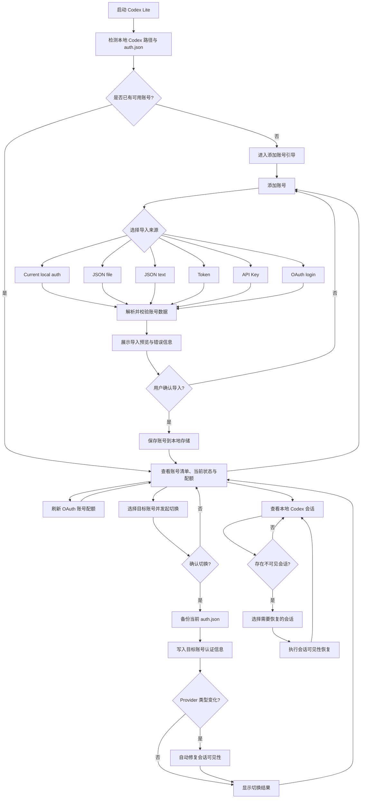

# Codex Lite 产品需求文档 (PRD)

## 1. 产品概述

### 1.1 产品定位
Codex Lite 是一款轻量级的本地桌面应用程序，专注于 Codex 账号的管理和切换。它为用户提供了一个统一的界面来管理多个 Codex 账号（OAuth 和 API Key 类型），实现账号快速切换、配额查看、会话管理等核心功能。

### 1.2 目标用户
- 拥有多个 Codex 账号的开发者
- 需要频繁切换不同 Codex 账号的用户
- 需要管理 OAuth 和 API Key 混合账号的专业用户
- 需要批量导入和管理账号的团队成员

### 1.3 核心价值
- **简化账号管理**：统一管理所有 Codex 账号，避免手动编辑配置文件
- **快速切换**：一键切换不同账号，自动备份和恢复配置
- **可视化配额**：直观显示账号配额使用情况
- **会话可见性修复**：自动修复账号切换后的会话可见性问题
- **本地优先**：所有数据存储在本地，无需远程服务器

### 1.4 技术栈
- **前端框架**：React 19 + TypeScript
- **桌面框架**：Tauri 2
- **后端语言**：Rust
- **构建工具**：Vite + pnpm
- **状态管理**：Zustand
- **图标库**：Lucide React

---

## 2. 功能需求

### 2.1 账号管理模块

#### 2.1.1 账号列表展示
**优先级**：P0

**功能描述**：
展示所有已添加的 Codex 账号，包括账号基本信息、配额状态、认证方式等。

**交互细节**：
- 显示账号昵称/邮箱
- 显示账号类型（OAuth / API Key）
- 显示当前激活状态（isCurrent 标识）
- 显示配额使用情况（百分比、重置时间）
- 支持搜索过滤（按昵称、邮箱、账号ID）
- 具体布局、信息密度和响应式呈现方式由 UI 设计阶段根据账号数量、窗口尺寸和操作优先级确定

**数据字段**：
- `id`：账号唯一标识
- `displayName`：显示名称
- `email`：邮箱（OAuth 账号）
- `authMode`：认证模式（oauth / api_key）
- `accountId`：Codex 账号 ID
- `userId`：用户 ID
- `planType`：订阅类型
- `isCurrent`：是否为当前激活账号
- `quota`：配额信息对象
- `tags`：标签数组
- `createdAt` / `updatedAt` / `lastUsedAt`：时间戳

---

#### 2.1.2 账号添加（多源导入）
**优先级**：P0

**功能描述**：
支持从多种来源导入 Codex 账号，包括本地文件、JSON 文本、Token 字段、API Key、OAuth 登录等。

**导入方式**：

1. **Current local auth**
   - 读取 `~/.codex/auth.json` 导入当前账号
   - 无需额外输入

2. **JSON file**
   - 通过文件选择器选择一个或多个 auth.json 文件
   - 支持批量导入预览
   - 可选择性确认导入

3. **JSON text**
   - 粘贴 JSON 格式的账号数据
   - 支持单个账号对象
   - 支持数组格式（批量导入）
   - 支持 sub2api 格式

4. **Token**
   - 手动输入 ID Token（必填）
   - 手动输入 Access Token（必填）
   - 手动输入 Refresh Token（可选）

5. **API Key**
   - 输入 API Key（必填，如 sk-xxx）
   - 输入显示名称（可选）
   - 输入 API Base URL（可选）

6. **OAuth login**
   - 启动 OAuth 登录流程
   - 自动打开浏览器授权页面
   - 支持自动回调（localhost:1455）
   - 支持手动粘贴回调 URL（回调监听失败时）
   - 实时显示登录状态和过期时间

**交互流程**：
1. 点击"添加账号"按钮
2. 在添加账号流程中选择导入方式
3. 根据选择的方式输入/选择数据
4. 预览导入结果
5. 确认添加账号

---

#### 2.1.3 账号切换
**优先级**：P0

**功能描述**：
切换当前激活的 Codex 账号，自动更新 `~/.codex/auth.json` 和 `config.toml`。

**交互细节**：
- 在目标账号的操作入口点击"切换"
- 显示确认弹窗，提示即将切换的账号信息
- 显示备份路径和警告信息
- 确认后执行切换操作
- 显示切换结果通知

**后端逻辑**：
1. 读取切换前的 provider 配置
2. 备份当前 `auth.json`（保存到 backups 目录）
3. 写入新账号的认证信息
4. 更新 `config.toml` 中的 model_provider
5. 读取切换后的 provider 配置
6. 如果 provider 类型变化（OAuth ↔ API），触发会话可见性修复
7. 返回切换结果和警告信息

**会话可见性修复**：
- 自动扫描所有 Codex 实例（默认实例和多开实例）
- 更新 rollout 文件首行的 `model_provider` 字段
- 更新 SQLite `threads` 表的 provider 记录
- 补齐 `session_index.jsonl` 缺失的条目
- 创建备份目录（支持失败回滚）

---

#### 2.1.4 账号编辑
**优先级**：P1

**功能描述**：
编辑 API Key 类型账号的配置信息。

**可编辑字段**：
- API Key
- 显示名称
- API Base URL

**限制**：
- OAuth 账号不支持编辑（需重新授权）
- 当前激活账号编辑后自动同步到 `auth.json`

---

#### 2.1.5 账号删除
**优先级**：P1

**功能描述**：
删除指定账号从本地存储中移除。

**交互细节**：
- 在目标账号的操作入口点击"删除"
- 显示确认弹窗
- 删除后从列表中移除
- 如果删除的是当前账号，清除激活状态

**限制**：
- 删除不影响 `~/.codex/auth.json`（除非是当前激活账号）
- 仅删除 Codex Lite 内部存储的账号记录

---

#### 2.1.6 OAuth 账号绑定
**优先级**：P2

**功能描述**：
为 API Key 账号绑定一个 OAuth 账号，用于需要 OAuth 认证的 API 场景。

**交互细节**：
- 在 API Key 账号的操作入口点击"绑定 OAuth"
- 从现有 OAuth 账号中选择
- 保存绑定关系

**使用场景**：
- API Key 账号需要访问需要 OAuth 认证的端点
- 使用 `requires_openai_auth = true` 的自定义 provider

---

### 2.2 配额管理模块

#### 2.2.1 配额查询
**优先级**：P0

**功能描述**：
查询 OAuth 账号的使用配额，包括小时配额和周配额。

**显示内容**：
- **小时配额**：剩余百分比、重置时间
- **周配额**：剩余百分比、重置时间
- **更新时间**：最后刷新时间戳
- **过期状态**：配额数据是否过期（stale）

**交互细节**：
- 在账号信息中显示可快速理解的配额状态
- 风险分级：充足 / 中等 / 紧张
- 点击"刷新"按钮更新配额
- 配额获取失败时显示错误信息和过期标识
- 每次页面可见时需要刷新所有Oauth账号的额度或者定期刷新（如每 10 分钟）

**数据结构**：
```typescript
interface CodexQuotaView {
  hourlyRemainingPercent?: number | null;
  hourlyResetAt?: number | null;
  weeklyRemainingPercent?: number | null;
  weeklyResetAt?: number | null;
  updatedAt?: number | null;
  stale: boolean;
}
```

---

#### 2.2.2 批量刷新
**优先级**：P1

**功能描述**：
一键刷新所有 OAuth 账号的配额信息。

**交互细节**：
- 点击工具栏"刷新"按钮
- 并发请求所有 OAuth 账号配额
- 显示加载状态
- 更新所有 OAuth 账号的配额状态

**限制**：
- 仅支持 OAuth 账号（API Key 账号无配额接口）
- 刷新失败时保留旧数据并标记为 stale

---

### 2.3 会话管理模块

#### 2.3.1 会话列表
**优先级**：P0

**功能描述**：
展示所有本地 Codex 会话，按项目分组显示。

**显示内容**：
- 会话标题
- 项目名称
- 工作目录（cwd）
- Provider 信息
- 可见状态（visible / hidden）
- 归档状态（archived）
- 更新时间

**分组规则**：
- 按 `project` + `cwd` 组合分组
- 同一项目的会话折叠在同一分组中
- 显示每组的会话数和可见数

**交互细节**：
- 支持搜索过滤（项目名、标题、路径、provider）
- 支持全选/取消全选
- 支持单个/批量选择
- 支持分组折叠/展开
- 一键展开/收起所有分组

---

#### 2.3.2 会话可见性恢复
**优先级**：P0

**功能描述**：
修复因账号切换导致的会话不可见问题。

**恢复逻辑**：
1. 扫描 `sessions/` 和 `archived_sessions/` 目录
2. 读取 `rollout-*.jsonl` 文件的 provider
3. 将不匹配的 provider 更新为目标 provider
4. 更新 SQLite `threads` 表的 provider 字段
5. 补齐 `session_index.jsonl` 缺失条目

**触发时机**：
- 账号切换时自动触发（如果 provider 类型变化）
- 用户手动点击"恢复可见"按钮

**修复范围**：
- 默认 Codex 实例（`~/.codex`）
- Cockpit 管理的多开实例

**备份机制**：
- 修复前自动创建备份目录
- 备份 rollout 文件、SQLite 数据库、session_index.jsonl
- 失败时自动回滚
- 保留最近 1 次备份

---

#### 2.3.3 会话删除
**优先级**：P1

**功能描述**：
删除选中的会话记录。

**交互细节**：
- 选择一个或多个会话
- 点击"删除"按钮
- 显示确认弹窗（提示删除数量）
- 确认后删除会话文件

**删除操作**：
- 删除 `rollout-*.jsonl` 文件
- 从 SQLite 删除对应 thread 记录
- 从 `session_index.jsonl` 删除条目

---

### 2.4 统计展示模块

#### 2.4.1 账号统计
**优先级**：P1

**功能描述**：
在账号管理相关视图中展示账号统计概览。

**统计指标**：
- 总账号数
- OAuth 账号数
- API Key 账号数
- 会话数

**呈现要求**：
- 指标含义清晰，便于快速扫描
- 不同账号类型和统计口径易于区分
- 具体视觉形式、位置和组件选择由 UI 设计阶段确定

---

#### 2.4.2 会话统计
**优先级**：P1

**功能描述**：
在会话管理相关视图中展示统计信息。

**统计指标**：
- 全部会话数
- 当前可见会话数
- 待恢复会话数（hidden）
- 已选择会话数

---

### 2.5 设置与日志模块

#### 2.5.1 设置页面
**优先级**：P1

**功能描述**：
展示应用程序的本地路径配置和系统信息。

**显示内容**：
- 应用数据目录
- 日志目录
- 账号文件路径
- 设置文件路径
- Codex Home 路径
- Codex Auth 文件路径
- Auth 文件存在状态

**操作按钮**：
- 检测 Codex 路径
- 打开数据目录
- 打开日志目录

---

#### 2.5.2 日志查看
**优先级**：P2

**功能描述**：
查看应用程序运行日志，敏感信息已脱敏。

**日志内容**：
- 应用启动日志
- 账号操作日志
- 切换操作日志
- 错误日志

**脱敏规则**：
- Token 替换为 `[REDACTED_TOKEN]`
- API Key 替换为 `[REDACTED_API_KEY]`
- Authorization Header 替换为 `[REDACTED_AUTHORIZATION]`
- OAuth Code 替换为 `[REDACTED_OAUTH_CODE]`

---

## 3. 非功能需求

### 3.1 性能要求
- 应用启动时间：< 2 秒
- 账号列表加载：< 500ms
- 会话列表加载：< 1 秒（1000 个会话以内）
- 账号切换响应：< 3 秒（包括备份和写入）
- 配额刷新响应：< 5 秒（单个账号）

### 3.2 兼容性要求
- **操作系统**：
  - macOS 10.15+（已验证 arm64）
  - Windows 10+（打包待验证）
  - Ubuntu 22.04+（Docker 打包已验证）
  
- **Node.js**：20+
- **Rust**：stable toolchain

### 3.3 安全性要求
- 所有账号数据存储在本地
- 不与远程 Codex Lite 服务器通信
- OAuth 回调监听仅在 localhost
- 日志自动脱敏敏感信息
- 切换前自动备份 auth.json

**数据存储路径**：
- macOS: `~/Library/Application Support/codex-lite`
- Windows: `%APPDATA%\codex-lite`
- Linux: `~/.local/share/codex-lite`

**敏感文件**：
- `accounts.json`：账号列表
- `backups/`：auth.json 备份
- `logs/`：应用日志

### 3.4 可用性要求
- 界面语言：支持中英文两种语言，默认是中文，部分特定的用语（如5h）需要英文，而不是5小时
- 响应式设计：适配不同窗口大小
- 错误提示：清晰的错误信息和恢复建议
- 操作反馈：Loading 状态、成功/失败通知
- 页面需要有轻微动效，提升交互体验

### 3.5 可维护性要求
- 代码类型检查：TypeScript strict mode
- 代码格式化：Rust fmt + Prettier
- 测试覆盖：Playwright 烟雾测试
- 版本管理：`schemaVersion` 字段跟踪数据格式

---

## 4. 数据模型

### 4.1 账号数据模型

```typescript
interface CodexAccountView {
  id: string;                              // 账号唯一标识（UUID）
  displayName: string;                     // 显示名称
  email?: string | null;                   // 邮箱（OAuth 账号）
  authMode: 'oauth' | 'o_auth' | 'api_key'; // 认证模式
  boundOauthAccountId?: string | null;     // 绑定的 OAuth 账号 ID
  accountId?: string | null;               // Codex 账号 ID
  userId?: string | null;                  // 用户 ID
  planType?: string | null;                // 订阅类型
  subscriptionActiveUntil?: string | null; // 订阅到期时间
  apiKey?: string | null;                  // API Key（API Key 账号）
  apiBaseUrl?: string | null;              // API Base URL
  quota?: CodexQuotaView | null;           // 配额信息
  quotaError?: AppError | null;            // 配额查询错误
  tags: string[];                          // 标签
  note?: string | null;                    // 备注
  createdAt: number;                       // 创建时间（Unix 时间戳）
  updatedAt: number;                       // 更新时间
  lastUsedAt?: number | null;              // 最后使用时间
  isCurrent: boolean;                      // 是否为当前激活账号
  capabilityWarning?: string | null;       // 能力警告
}
```

### 4.2 会话数据模型

```typescript
interface CodexSessionView {
  id: string;                    // 会话 ID
  title: string;                 // 会话标题
  project: string;               // 项目名称
  cwd: string;                   // 工作目录
  provider: string;              // Rollout 中的 provider
  targetProvider: string;        // 目标 provider（config.toml）
  visible: boolean;              // 是否在 Codex App 中可见
  archived: boolean;             // 是否归档
  updatedAt?: number | null;     // 更新时间
  createdAt?: number | null;     // 创建时间
  rolloutPath?: string | null;   // Rollout 文件路径
  preview?: string | null;       // 预览文本
}
```

### 4.3 配额数据模型

```typescript
interface CodexQuotaView {
  hourlyRemainingPercent?: number | null;  // 小时剩余百分比
  hourlyResetAt?: number | null;           // 小时重置时间（Unix 时间戳）
  weeklyRemainingPercent?: number | null;  // 周剩余百分比
  weeklyResetAt?: number | null;           // 周重置时间
  updatedAt?: number | null;               // 更新时间
  stale: boolean;                          // 是否过期
}
```

---

## 5. 用户流程

### 5.1 首次使用流程

1. 用户启动 Codex Lite
2. 应用检测本地路径（`~/.codex/auth.json`）
3. 如果未找到账号，显示空状态页面
4. 用户点击"添加账号"按钮
5. 选择导入方式（推荐"Current local auth"）
6. 确认导入，账号添加到列表
7. 自动标记为当前账号

### 5.2 账号切换流程

1. 用户在账号列表中找到目标账号
2. 在目标账号的操作入口点击"切换"
3. 弹出确认弹窗，显示目标账号信息
4. 用户点击"确认切换"
5. 应用备份当前 `auth.json`
6. 写入目标账号的认证信息
7. 如果 provider 类型变化，自动触发会话修复
8. 显示切换成功通知和修复摘要
9. 账号列表更新，目标账号标记为当前

### 5.3 批量导入流程

1. 用户点击"添加账号"按钮
2. 选择"JSON file"导入方式
3. 点击"Choose JSON"选择多个 auth.json 文件
4. 应用自动解析文件并生成预览表格
5. 用户勾选需要导入的账号
6. 点击"Add account"按钮
7. 应用批量导入选中账号
8. 显示导入结果（成功数 / 失败数）

### 5.4 会话恢复流程

1. 用户切换账号后发现历史会话不可见
2. 切换到"会话管理"标签
3. 查看会话列表，发现多个会话状态为"需恢复"
4. 勾选需要恢复的会话
5. 点击"恢复可见"按钮
6. 应用扫描并修复会话 provider 元数据
7. 修复完成后，会话状态更新为"可见"
8. 用户返回 Codex App 刷新，会话重新显示

---

## 6. UI 设计边界与产品流程图

### 6.1 UI 设计边界

本 PRD 只规定用户目标、功能范围、业务规则、必需信息、关键状态和异常处理，不规定页面布局、组件形态或视觉排版。后续 AI UI 设计应根据本 PRD 自主完成信息架构、页面组织、布局方式、组件选择、视觉层级和交互细节。

UI 设计需满足以下约束：
- 覆盖本 PRD 中定义的账号管理、配额管理、会话管理、设置与日志能力
- 保证高频操作易发现、易执行，包括添加账号、切换账号、刷新配额、恢复会话
- 对破坏性或高风险操作提供确认、反馈和可恢复路径
- 在不同窗口尺寸下保持信息可读、操作可达、状态清晰
- 具体信息架构、导航模式和组件形态由 UI 设计阶段自行判断

### 6.2 核心产品流程图



---

## 7. 技术实现要点

### 7.1 前端架构

- **状态管理**：使用 Zustand 创建独立 Store
  - `useCodexAccountsStore`：账号管理状态
  - `useCodexSessionsStore`：会话管理状态
  - `useImportFlowStore`：导入流程状态
  - `useSettingsStore`：设置页面状态

- **组件设计**（命名和拆分可随 UI 设计调整）：
  - 页面组件：`AccountsPage`, `SessionsPage`, `SettingsPage`, `LogsPage`
  - 功能组件：`AccountItem`, `AccountImportFlow`, `BatchImportPreview`
  - UI 组件：`Button`, `IconButton`, `Tabs`, `Panel`, `SearchInput`

### 7.2 后端架构（Rust）

- **命令模块** (`src-tauri/src/commands/`)：
  - `account.rs`：账号 CRUD 操作
  - `session.rs`：会话查询和修复
  - `quota.rs`：配额查询
  - `oauth.rs`：OAuth 登录流程
  - `import.rs`：导入逻辑
  - `system.rs`：系统信息查询

- **数据模块** (`src-tauri/src/models/`)：
  - `account.rs`：账号数据结构
  - `session.rs`：会话数据结构
  - `auth.rs`：认证数据结构

- **基础设施** (`src-tauri/src/infra/`)：
  - `storage.rs`：JSON 文件读写
  - `atomic_write.rs`：原子写入
  - `redaction.rs`：敏感信息脱敏
  - `codex_keychain.rs`：Codex 配置读写

### 7.3 关键算法

#### 会话可见性修复算法

```rust
fn repair_session_visibility() {
  for instance in collect_instances() {
    let target_provider = read_target_provider(instance);
    
    // 1. 扫描 rollout 文件
    let rollout_changes = collect_rollout_provider_changes(instance, target_provider);
    
    // 2. 扫描 SQLite 记录
    let sqlite_rows = count_sqlite_rows_to_update(instance, target_provider);
    
    // 3. 扫描索引缺失项
    let missing_entries = count_missing_session_index_entries(instance);
    
    if no_changes { continue; }
    
    // 4. 创建备份
    let backup_dir = backup_instance_files(instance);
    
    // 5. 执行修复
    match repair_single_instance(instance, target_provider) {
      Ok(_) => log("修复成功"),
      Err(_) => restore_from_backup(backup_dir),
    }
  }
}
```

---

## 8. 测试策略

### 8.1 单元测试
- Rust 后端：`cargo test`
- TypeScript 类型检查：`pnpm typecheck`

### 8.2 集成测试
- Playwright 烟雾测试：`pnpm smoke`
- 测试覆盖：
  - 账号导入流程
  - 账号切换流程
  - 批量导入预览
  - OAuth 回调处理

### 8.3 手动测试清单
- 真实账号烟雾测试（见 `docs/real-account-smoke.md`）
- 多平台打包验证（macOS / Windows / Linux）
- 会话修复端到端测试

---

## 9. 发布计划

### 9.1 当前阶段（Early Stage）
- ✅ 核心功能已实现
- ✅ macOS arm64 本地打包验证通过
- ✅ Ubuntu 22.04 Docker 打包验证通过
- ⏳ Windows 打包和原生测试待验证
- ⏳ 配额刷新需要更广泛的真实账号验证
- ⏳ 批量导入预览配额检查未完全实现

### 9.2 后续优化方向
- 集成 OS 级密钥存储（macOS Keychain / Windows Credential Manager）
- 支持账号标签和分组
- 支持会话搜索和高级过滤
- 支持导出账号列表
- 支持主题切换（暗色/亮色）
- 支持多语言（完整英文本地化）

---

## 10. 风险与限制

### 10.1 已知限制
- OAuth 回调需要 `localhost:1455` 端口可用（否则需手动粘贴回调 URL）
- API Key 账号无配额查询接口
- 会话修复需要 Codex App 关闭（避免 SQLite 锁冲突）
- 凭据当前存储在明文 JSON（计划后续使用系统密钥存储）

### 10.2 潜在风险
- 跨平台兼容性：Windows 和 Linux 需要更多验证
- 数据迁移：未来 schema 升级需要迁移逻辑
- 安全性：本地 JSON 存储可被其他进程读取

### 10.3 缓解措施
- 提供详细的故障排查文档（`docs/troubleshooting.md`）
- 实现数据备份和恢复机制（`docs/migration-and-recovery.md`）
- 日志自动脱敏，避免敏感信息泄露
- 账号切换前自动备份，支持回滚

---

## 11. 参考文档

- [README.md](./README.md)：项目介绍和使用指南
- [账号切换.md](./账号切换.md)：账号切换配置说明
- [会话恢复.md](./会话恢复.md)：会话可见性修复详细流程
- [docs/security.md](./docs/security.md)：安全边界和隐私说明
- [docs/troubleshooting.md](./docs/troubleshooting.md)：常见问题排查
- [docs/migration-and-recovery.md](./docs/migration-and-recovery.md)：数据迁移和恢复
- [docs/real-account-smoke.md](./docs/real-account-smoke.md)：真实账号测试清单

---

**文档版本**：v1.1  
**创建日期**：2026-06-17  
**最后更新**：2026-06-18
